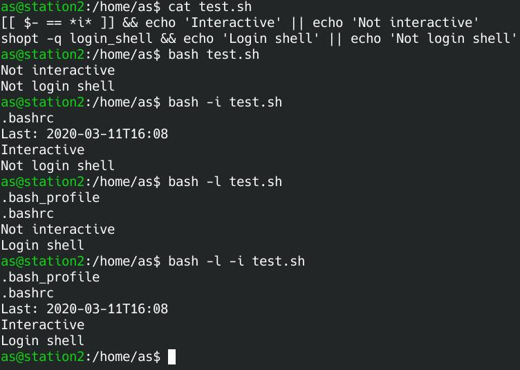

Some parts of my tests differ from information from other internet sources. May be it's OS related, something changed by time or it's a mistake by someone.

# Shell invokes
Shells have basically two behaviours. Interactive (or not) and login-shell (or not).
| Tests on Arch Linux     | Interactive | Login |
| ----------------------- | ----------- | ----- |
| `bash`                  | No          | No    |
| `bash -i`               | Yes         | No    |
| `bash -l`               | No          | Yes   |
| `bash -i -l`            | Yes         | Yes   |
| SSH login               | Yes         | Yes   |
| Local TTY               | Yes         | No <sup>1)</sup>   |
| Terminal in XSession    | Yes         | No    |

<sup>1)</sup> Even if you just logged in on terminal!  

# Files
* `/etc/environment` Only global variables, Key=Value per line
* `/etc/profile` Only on login shells (Remote like SSH)
  * Runs `/etc/profile.d/*`
* `~/.bash_profile` Will be called after `/etc/profile*` if exists.
* `/etc/bash.bashrc` Is called on existing $PS1 and $BASH even on non interactive shells (that makes them look interactive again though)
* `~/.bashrc`  Will be called after `/etc/bash.bashrc` if exists.

Extra OpenSSH-Server environment files:
* ~/.ssh/environment (PermitUserEnvironment)
* ~/.ssh/rc (PermitUserRC) 
* /etc/ssh/sshrc

SSH-Login call stack:
* `/etc/environment`
* `/etc/profile`
  * If exists, calls: `/etc/profile.d/*`
  * If $PS1 and $BASH calls: `/etc/bash.bashrc` (Has own filter for interactive mode)
* `~/.bash_profile` (if exists)
  * If exists, call: `~./bashrc` (Has own filter for interactive mode)


# Test-Script
```bash
[[ $- == *i* ]] && echo 'Interactive' || echo 'Not interactive'
shopt -q login_shell && echo 'Login shell' || echo 'Not login shell'
```


Summary:
- **profiles** only on login shells.
- **bashrc** only on interactive shells (directly called) or login shells (called by profile).
- Neither interactice nor login shell calls really nothing. (tested with systemd)
- If you login via SSH, it's an interactive login shell.

